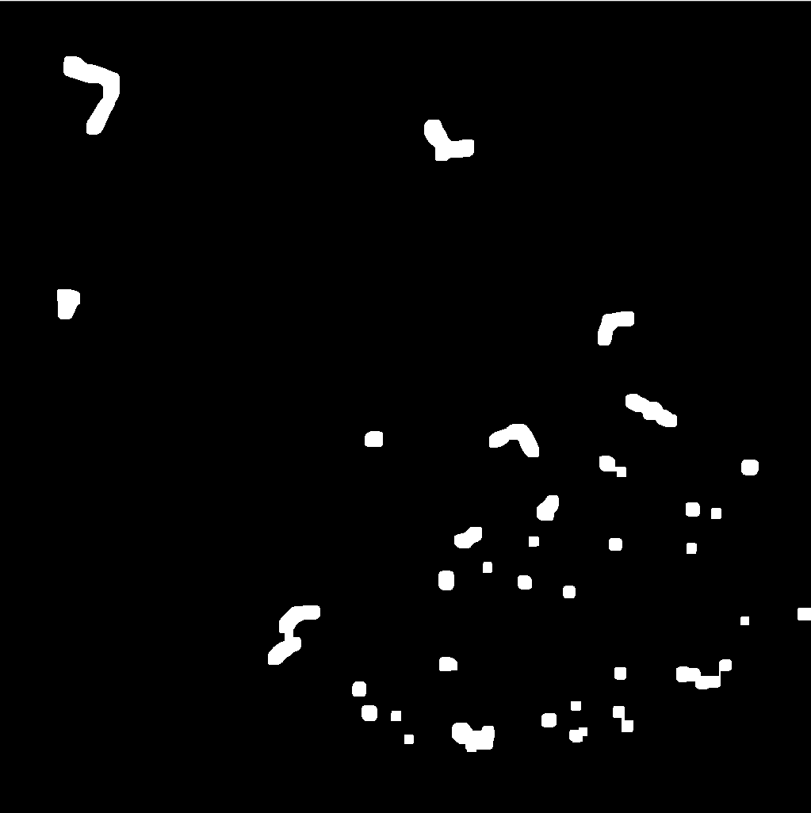
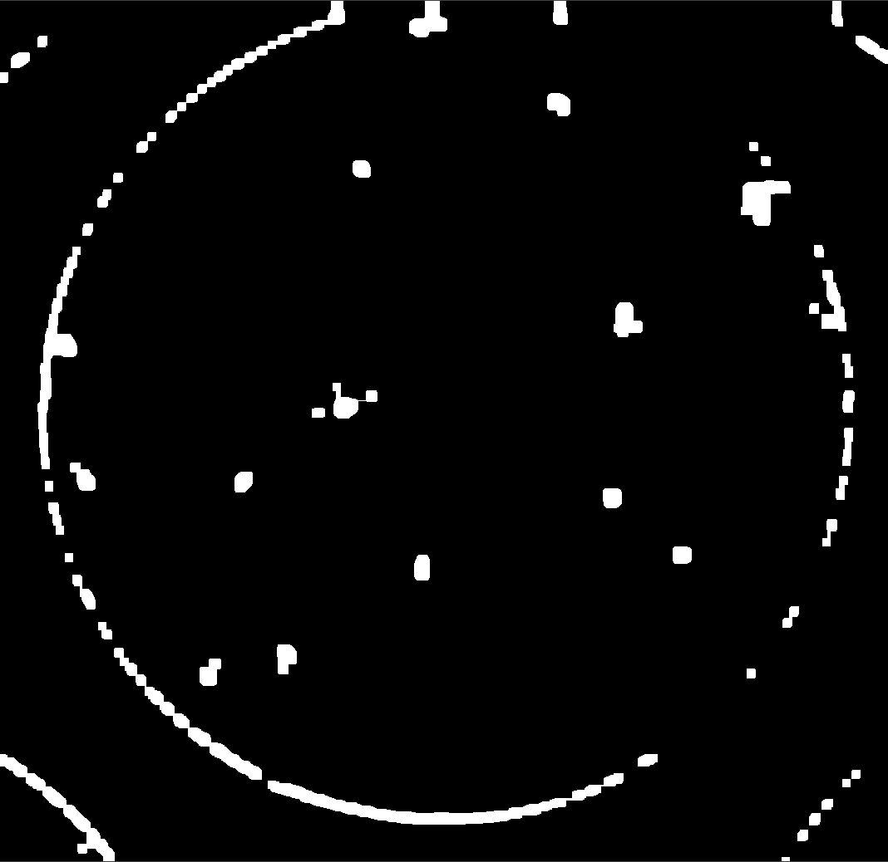
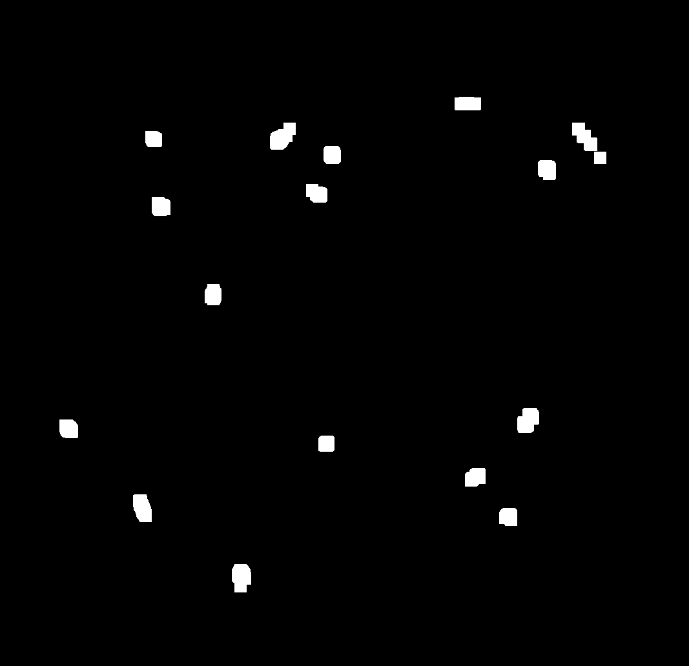
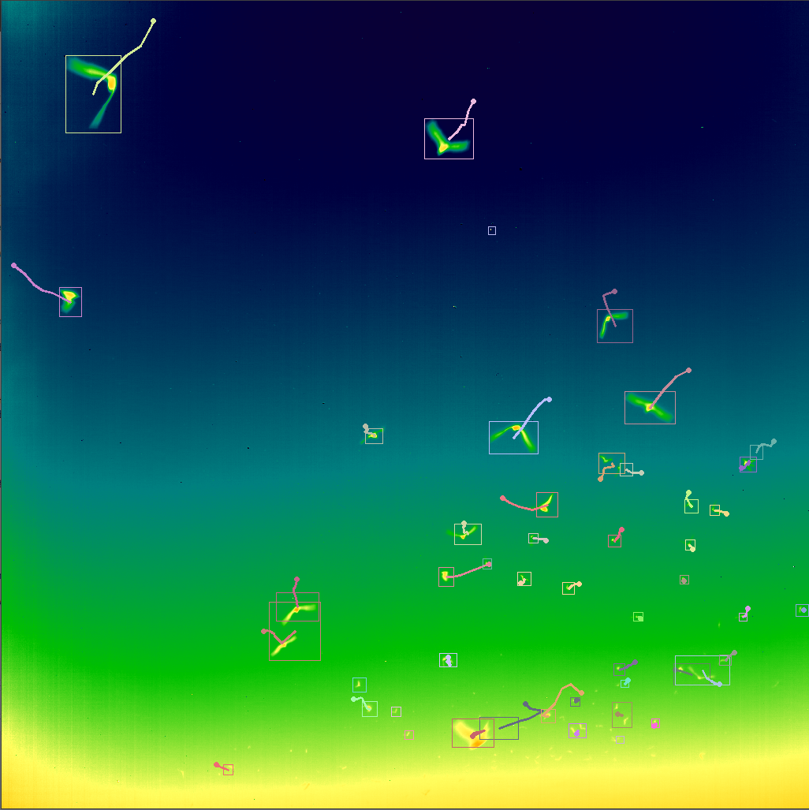
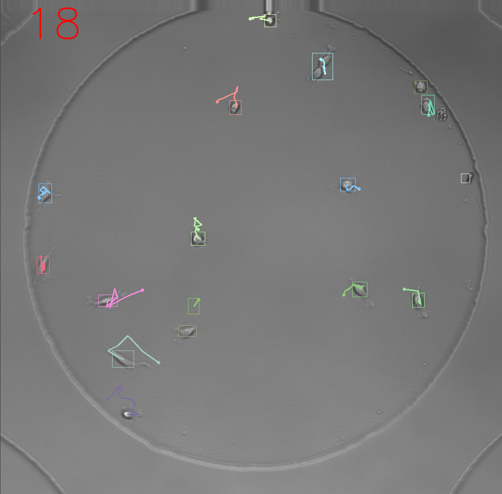
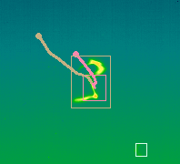
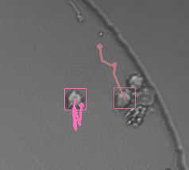
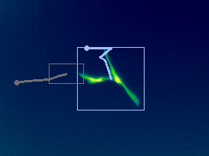
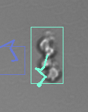

# Multiple Object Tracking

An important step to tracking the objects in the different videos were the segmentation of objects. The algorithm for segmentation were different for both videos. For the bats video, the code is as follows:

<pre>               gray = cv2.cvtColor(img, cv2.COLOR_BGR2GRAY)
                    blur = cv2.GaussianBlur(gray, (19,19),0)
                    thresh_output = adaptive_threshold(blur)
                    kernel = np.ones((10,10), np.uint8)
                    dialated = cv2.dilate(thresh_output, kernel, iterations=1)
                    dialated = cv2.dilate(dialated, kernel, iterations=1)
                    erode = cv2.erode(dialated, kernel, iterations=1)
            </pre>

This segmentation does not detect bats that are far away from the scene. The bats are too small and will be detected as noise. However, since the task is to track bats, these small bats will not show much of the tracking since they will look like they are not moving.  

If this segmentation algorithm was used for the cells the result will be messy and difficult to properly track each cell.

The first problem is that the segmentation also detects blobs outside of the region of interest. Those blobs are false positive detections. The method of thresholding is the same--we use an adaptive threshold on the image. However, after the image is binary, we create a region of interest that is specifically around the dish that the cells are in. By doing this we remove the false positive results outside the dish. Then, since the result of the threshold creates holes in the cells, we need to dialate and erode the image.

<pre>               gray = cv2.cvtColor(img, cv2.COLOR_BGR2GRAY)
                    blur = cv2.GaussianBlur(gray, (9,9),0)
                    thresh_output = adaptive_threshold(blur)

                    w,h = thresh_output.shape[0:2]
                    roi = np.zeros((w,h), dtype="uint8")
                    circle_img = cv2.circle(roi, (int(thresh_output.shape[0]/2)+18,int(thresh_output.shape[1]/2) - 40), 470, (255,255,255), -1)
                    masked_data = cv2.bitwise_and(thresh_output, thresh_output, mask=circle_img)

                    kernel = np.ones((5,5), np.uint8)
                    erode = cv2.erode(masked_data, kernel, iterations=1)
                    kernel2 = np.ones((10,10), np.uint8)
                    dialated = cv2.dilate(erode, kernel2, iterations=1)
                    dialated = cv2.dilate(dialated, kernel2, iterations=1) 
            </pre>

The only downside to this threshold is that the tiny cells that exist in the dish is not detected by the segmentation. However, for the purpose of tracking this segmentation is good enough.  

With these segmentations we can track the object with relatively good accuracy.

 

Good Parts:

 

Bad Parts:

 

The track sometimes succesfully segments and tracks objects despite there being an obstacle near the desired object. However, the biggest problem of the tracking algorithm is that the track will sometimes combine multiple objects into one track.  

The way that I decide to begin new tracks and terminate old tracks was to keep account of the number of consecutive misses and whether the blob (centroid) is still being tracked.  
Upon entering the find match function, I set all of the blobs "match or new" variable to false. Then I loop through all blobs and compare them with the frame blobs. If they found a match (smallest distance), then I will set this value to true. After all the values are set, I looped through the blobs again to check whether the value is true or false. If it is false, I will add one to the number of misses for the blob. I set the threshold value for the number of misses to 10\. So if the number of misses is 5 or greater, I will set the "still being tracked" variable to false. During the drawing stage, I will only draw for blobs that are still being tracked.

<pre>                def matchCurrentFrameBlobs(existingBlobs, currFrameBlobs):
                        for existingBlob in existingBlobs:
                            existingBlob.foundMatchorIsNew = False
                            existingBlob.predict()

                        # Compare and assign
                        for currBlob in currFrameBlobs:
                            idxLeastDist = 0
                            leastDist = 100000
                            for i in range(len(existingBlobs)):
                                if existingBlobs[i].stillBeingTracked:
                                    dist = distance(currBlob.centroid, existingBlobs[i].centroid)
                                    if dist < leastDist:
                                        idxLeastDist = i 
                                        leastDist = dist
                            if leastDist < currBlob.diagSize * 1.15:
                                existingBlobs[idxLeastDist].centroid = currBlob.centroid
                                existingBlobs[idxLeastDist].KF.update(currBlob.centroid)
                                existingBlobs[idxLeastDist].bound_rect = currBlob.bound_rect
                                existingBlobs[idxLeastDist].diagSize = currBlob.diagSize
                                existingBlobs[idxLeastDist].foundMatchorIsNew = True
                                existingBlobs[idxLeastDist].stillBeingTracked = True
                                existingBlobs[idxLeastDist].addHistory(currBlob)
                            else:
                                currBlob.foundMatchorIsNew = True
                                existingBlobs.append(currBlob)
                        for i in range(len(existingBlobs)):
                            if existingBlobs[i].foundMatchorIsNew == False:
                                existingBlobs[i].numberOfConsecutiveMiss += 1
                            if existingBlobs[i].numberOfConsecutiveMiss > 5:
                                existingBlobs[i].stillBeingTracked = False 
            </pre>

When objects touch with each other, the bounding boxes and track become one. This is a problem that was difficult to fix. I think that the primary way of fixing this problem is to fix the segmentation. After messing around with the kernel size for dialation and erosion the final kernel showed the best performance. To compensate for when objects occlude with each other, I let the centroid measurement equal the prediction. This only lasts for 10 frames since the threshold for the number of misses is 10\.

Spurious detections in my algorithm tend to not be noise in the image. This is because the image preperation stage removes most noise in the image. Most spurious detections will be a new bat/cell. However, if there are random objects that appear and disappear, the algorithm will only catch them for awhile but when they are counted as a miss, the algorithm will ignore it.

The current kinematic model works really well to detect objects that does not have huge changes in position. This is especially when tracking cells since there are big changes in position. I think it will be better if the kinematic model include the velocity since the prediction will be more accurate.

